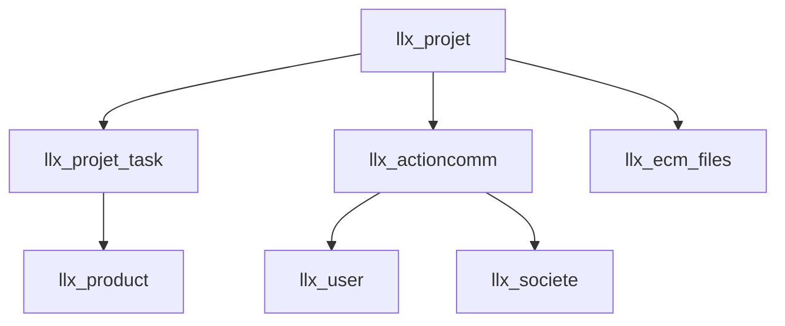

# 🎫 Audit Système de Ticketing & Suivi Chantier Dolibarr

**Architecture complète pour un système de ticketing intégré dans Dolibarr BTP**

---

## 📋 1. Analyse de l'Existant Dolibarr

### 🏗️ **Modules Dolibarr Utilisables**

| Module | Tables Clés | Fonctionnalités | Utilisation Ticketing |
|--------|-------------|-----------------|----------------------|
| **Projects** | `llx_projet`, `llx_projet_task` | Projets, tâches, planning | Base pour chantiers |
| **Actions** | `llx_actioncomm` | Événements, rappels, suivi | Tickets, interventions |
| **Users** | `llx_user` | Utilisateurs, droits | Assignation, validation |
| **Companies** | `llx_societe` | Clients, contacts | Demandeurs tickets |
| **Products** | `llx_product` | Catalogue, stocks | Matériel interventions |
| **ECM** | `llx_ecm_files` | Documents, photos | Preuves, rapports |

### 🔗 **Relations Existantes**


### ✅ **Points Forts Dolibarr**
- **Architecture modulaire** extensible
- **Gestion de projets** native avec tâches
- **Système d'actions** complet (événements, rappels)
- **Workflow** configurable par statuts
- **API REST** pour applications mobiles
- **Gestion de droits** granulaire

### ⚠️ **Limitations Identifiées**
- **Pas de ticketing** natif structuré
- **Workflow tickets** non optimisé BTP
- **Interface mobile** basique pour terrain
- **Géolocalisation** absente
- **Photos/signatures** non intégrées
- **Escalade automatique** manquante

---

## 🎯 2. Conception Système Ticketing BTP

### 📊 **Architecture Globale**

```mermaid
graph TD
    A[App Mobile Chantier] --> B[API Dolibarr + Extensions]
    C[Interface Web Admin] --> B
    B --> D[Base Dolibarr Étendue]
    B --> E[Notifications Push]
    B --> F[Géolocalisation]
    B --> G[Stockage Photos/Docs]

    D --> H[llx_projet - Chantiers]
    D --> I[llx_ticket - Tickets Custom]
    D --> J[llx_intervention - Interventions]
    D --> K[llx_actioncomm - Suivi]
```



### 🎫 **Types de Tickets BTP**

| Type | Priorité | SLA | Workflow |
|------|----------|-----|----------|
| **Panne Électrique** | Critique | 2h | Création → Assignation → Intervention → Test → Clôture |
| **Maintenance Préventive** | Normal | 7j | Planification → Assignation → Intervention → Rapport → Clôture |
| **Installation** | Normal | 3j | Devis → Validation → Planification → Installation → Réception |
| **Dépannage Urgent** | Urgent | 4h | Création → Intervention → Réparation → Test → Facturation |
| **Mise en Conformité** | Normal | 15j | Audit → Devis → Validation → Travaux → Contrôle → Certificat |

### 📱 **Flux Utilisateur Mobile**

```mermaid
sequenceDiagram
    participant Client
    participant AppMobile
    participant API
    participant Technicien
    participant Manager

    Client->>AppMobile: Création ticket
    AppMobile->>API: POST /tickets + géoloc + photos
    API->>Manager: Notification nouveau ticket
    Manager->>API: Assignation technicien
    API->>Technicien: Notification assignation
    Technicien->>AppMobile: Prise en charge
    AppMobile->>API: MAJ statut + temps passé
    Technicien->>AppMobile: Résolution + signature client
    AppMobile->>API: Clôture + rapport + photos
    API->>Client: Notification résolution
```



---

## 🗃️ 3. Structure de Données Étendue

### 🆕 **Nouvelles Tables Custom**

#### **llx_btp_ticket** - Tickets Principaux
```sql
CREATE TABLE llx_btp_ticket (
    rowid INT AUTO_INCREMENT PRIMARY KEY,
    entity INT DEFAULT 1,

    -- Identification
    ref VARCHAR(30) NOT NULL UNIQUE,               -- BTP-TICK-2024-001
    title VARCHAR(255) NOT NULL,                   -- Titre du ticket
    description TEXT,                              -- Description problème

    -- Classification
    type_ticket VARCHAR(50) NOT NULL,              -- panne/maintenance/installation/depannage/conformite
    priority INT DEFAULT 2,                        -- 1=critique, 2=urgent, 3=normal, 4=bas
    category VARCHAR(100),                         -- electrique/eclairage/chauffage/alarme

    -- Relations
    fk_projet INT,                                 -- Chantier/Projet lié
    fk_soc INT NOT NULL,                          -- Client demandeur
    fk_contact INT,                               -- Contact spécifique
    fk_user_request INT,                          -- Utilisateur demandeur
    fk_user_assign INT,                           -- Technicien assigné
    fk_user_manager INT,                          -- Responsable validation

    -- Localisation
    address TEXT,                                  -- Adresse intervention
    gps_latitude DECIMAL(10,8),                   -- Position GPS
    gps_longitude DECIMAL(11,8),                  -- Position GPS
    building_info TEXT,                           -- Bâtiment/Étage/Local
    access_instructions TEXT,                     -- Instructions d'accès

    -- Temporal
    date_creation DATETIME NOT NULL,              -- Création ticket
    date_requested DATETIME,                      -- Date demandée intervention
    date_assigned DATETIME,                       -- Date assignation
    date_started DATETIME,                        -- Début intervention
    date_resolved DATETIME,                       -- Fin intervention
    date_closed DATETIME,                         -- Clôture administrative

    -- Workflow
    status VARCHAR(20) DEFAULT 'nouveau',         -- nouveau/assigne/en_cours/resolu/ferme/annule
    substatus VARCHAR(50),                        -- attente_pieces/attente_validation/test_en_cours
    resolution_type VARCHAR(50),                  -- repare/remplace/configure/maintenance

    -- Métadonnées
    estimated_duration INT,                       -- Durée estimée (minutes)
    actual_duration INT,                         -- Durée réelle (minutes)
    material_cost DECIMAL(10,2),                 -- Coût matériel
    labor_cost DECIMAL(10,2),                    -- Coût main d'œuvre

    -- SLA & Escalade
    sla_response_hours INT DEFAULT 24,           -- SLA réponse (heures)
    sla_resolution_hours INT DEFAULT 72,         -- SLA résolution (heures)
    escalation_level INT DEFAULT 0,              -- Niveau escalade
    escalation_date DATETIME,                    -- Date prochaine escalade

    -- Satisfaction
    customer_rating INT,                          -- Note client (1-5)
    customer_comment TEXT,                        -- Commentaire client

    -- Facturation
    billable BOOLEAN DEFAULT TRUE,                -- Facturable
    billed BOOLEAN DEFAULT FALSE,                 -- Facturé
    fk_facture INT,                              -- Facture générée

    -- Audit
    date_modification TIMESTAMP DEFAULT CURRENT_TIMESTAMP ON UPDATE CURRENT_TIMESTAMP,
    fk_user_creat INT,
    fk_user_modif INT,

    INDEX idx_ticket_ref (ref),
    INDEX idx_ticket_status (status),
    INDEX idx_ticket_priority (priority),
    INDEX idx_ticket_assign (fk_user_assign),
    INDEX idx_ticket_projet (fk_projet),
    INDEX idx_ticket_client (fk_soc),
    INDEX idx_ticket_date_creation (date_creation),
    INDEX idx_ticket_gps (gps_latitude, gps_longitude),

    FOREIGN KEY (fk_projet) REFERENCES llx_projet(rowid),
    FOREIGN KEY (fk_soc) REFERENCES llx_societe(rowid),
    FOREIGN KEY (fk_user_assign) REFERENCES llx_user(rowid)
);
```

#### **llx_btp_ticket_intervention** - Interventions Détaillées
```sql
CREATE TABLE llx_btp_ticket_intervention (
    rowid INT AUTO_INCREMENT PRIMARY KEY,
    entity INT DEFAULT 1,

    -- Relations
    fk_ticket INT NOT NULL,                       -- Ticket parent
    fk_user_technicien INT NOT NULL,             -- Technicien intervenant

    -- Intervention
    date_debut DATETIME,                          -- Début intervention
    date_fin DATETIME,                            -- Fin intervention
    duree_minutes INT,                            -- Durée effective

    -- Diagnostic
    diagnostic TEXT,                              -- Diagnostic technique
    cause_panne TEXT,                            -- Cause identifiée
    travaux_realises TEXT,                       -- Travaux effectués

    -- Matériel
    pieces_utilisees JSON,                        -- Liste pièces remplacées
    outils_utilises JSON,                        -- Outils spéciaux
    cout_materiel DECIMAL(10,2) DEFAULT 0,       -- Coût matériel

    -- Validation
    tests_effectues TEXT,                         -- Tests de fonctionnement
    conformite_normes BOOLEAN DEFAULT FALSE,     -- Conformité vérifiée
    mesures_securite TEXT,                       -- Mesures sécurité prises

    -- Client
    signature_client LONGTEXT,                    -- Signature électronique base64
    commentaire_client TEXT,                     -- Commentaires client
    satisfaction INT,                             -- Note satisfaction (1-5)

    -- Suivi
    recommandations TEXT,                         -- Recommandations futures
    prochaine_maintenance DATE,                  -- Prochaine maintenance
    garantie_fin DATE,                           -- Fin garantie travaux

    date_creation DATETIME DEFAULT CURRENT_TIMESTAMP,
    tms TIMESTAMP DEFAULT CURRENT_TIMESTAMP ON UPDATE CURRENT_TIMESTAMP,

    INDEX idx_intervention_ticket (fk_ticket),
    INDEX idx_intervention_technicien (fk_user_technicien),
    INDEX idx_intervention_date (date_debut),

    FOREIGN KEY (fk_ticket) REFERENCES llx_btp_ticket(rowid),
    FOREIGN KEY (fk_user_technicien) REFERENCES llx_user(rowid)
);
```

#### **llx_btp_ticket_media** - Photos & Documents
```sql
CREATE TABLE llx_btp_ticket_media (
    rowid INT AUTO_INCREMENT PRIMARY KEY,
    entity INT DEFAULT 1,

    -- Relations
    fk_ticket INT NOT NULL,                       -- Ticket lié
    fk_intervention INT,                          -- Intervention si applicable

    -- Fichier
    filename VARCHAR(255) NOT NULL,               -- Nom fichier
    filepath TEXT NOT NULL,                       -- Chemin stockage
    filesize INT,                                 -- Taille fichier
    mimetype VARCHAR(100),                        -- Type MIME

    -- Métadonnées
    type_media VARCHAR(50),                       -- photo_avant/photo_apres/schema/rapport/signature
    description TEXT,                             -- Description média

    -- Géolocalisation photo
    gps_latitude DECIMAL(10,8),                   -- Position GPS photo
    gps_longitude DECIMAL(11,8),                  -- Position GPS photo

    -- Créateur
    fk_user_creat INT,                           -- Qui a ajouté
    date_creation DATETIME DEFAULT CURRENT_TIMESTAMP,

    INDEX idx_media_ticket (fk_ticket),
    INDEX idx_media_type (type_media),

    FOREIGN KEY (fk_ticket) REFERENCES llx_btp_ticket(rowid),
    FOREIGN KEY (fk_intervention) REFERENCES llx_btp_ticket_intervention(rowid)
);
```

#### **llx_btp_ticket_historique** - Historique & Suivi
```sql
CREATE TABLE llx_btp_ticket_historique (
    rowid INT AUTO_INCREMENT PRIMARY KEY,
    entity INT DEFAULT 1,

    -- Relations
    fk_ticket INT NOT NULL,                       -- Ticket concerné
    fk_user INT,                                 -- Utilisateur action

    -- Action
    type_action VARCHAR(50) NOT NULL,             -- creation/assignation/modification/resolution/cloture
    ancien_statut VARCHAR(20),                   -- Statut avant
    nouveau_statut VARCHAR(20),                  -- Statut après

    -- Détails
    champs_modifies JSON,                        -- Détail des modifications
    commentaire TEXT,                            -- Commentaire action

    -- Automatisation
    action_automatique BOOLEAN DEFAULT FALSE,    -- Action auto ou manuelle
    declencheur VARCHAR(100),                    -- SLA/escalade/workflow

    -- Temporal
    date_action DATETIME DEFAULT CURRENT_TIMESTAMP,
    duree_statut_precedent INT,                  -- Minutes dans statut précédent

    INDEX idx_historique_ticket (fk_ticket),
    INDEX idx_historique_user (fk_user),
    INDEX idx_historique_date (date_action),
    INDEX idx_historique_type (type_action),

    FOREIGN KEY (fk_ticket) REFERENCES llx_btp_ticket(rowid),
    FOREIGN KEY (fk_user) REFERENCES llx_user(rowid)
);
```

#### **llx_btp_ticket_sla** - Gestion SLA & Escalades
```sql
CREATE TABLE llx_btp_ticket_sla (
    rowid INT AUTO_INCREMENT PRIMARY KEY,
    entity INT DEFAULT 1,

    -- Configuration SLA par type/priorité
    type_ticket VARCHAR(50) NOT NULL,
    priority INT NOT NULL,

    -- Délais (en heures)
    sla_response_hours INT NOT NULL,              -- Délai prise en compte
    sla_resolution_hours INT NOT NULL,            -- Délai résolution

    -- Escalade
    escalade_level_1_hours INT,                  -- 1er niveau escalade
    escalade_level_2_hours INT,                  -- 2ème niveau escalade
    escalade_level_3_hours INT,                  -- 3ème niveau escalade

    -- Responsables escalade
    fk_user_escalade_1 INT,                      -- Manager niveau 1
    fk_user_escalade_2 INT,                      -- Direction niveau 2
    fk_user_escalade_3 INT,                      -- Direction générale

    -- Notifications
    notification_client_creation BOOLEAN DEFAULT TRUE,
    notification_client_assignation BOOLEAN DEFAULT TRUE,
    notification_client_resolution BOOLEAN DEFAULT TRUE,
    notification_manager_escalade BOOLEAN DEFAULT TRUE,

    -- Validité
    actif BOOLEAN DEFAULT TRUE,
    date_creation DATETIME DEFAULT CURRENT_TIMESTAMP,

    UNIQUE KEY unique_sla (type_ticket, priority),

    FOREIGN KEY (fk_user_escalade_1) REFERENCES llx_user(rowid),
    FOREIGN KEY (fk_user_escalade_2) REFERENCES llx_user(rowid),
    FOREIGN KEY (fk_user_escalade_3) REFERENCES llx_user(rowid)
);
```

### **Tables Complémentaires pour le Suivi Chantier**

#### **llx_btp_zone** - Zones de Travail sur Chantier

```sql
CREATE TABLE llx_btp_zone (
    rowid INT AUTO_INCREMENT PRIMARY KEY,
    entity INT DEFAULT 1,
    fk_projet INT NOT NULL,
    ref VARCHAR(30) NOT NULL,
    label VARCHAR(255) NOT NULL,
    description TEXT,
    zone_type ENUM('electrique', 'plomberie', 'chauffage', 'general') DEFAULT 'general',
    surface_m2 DECIMAL(10,2),
    statut INT DEFAULT 1,
    date_debut DATE,
    date_fin_prevue DATE,
    date_fin_reelle DATE,
    responsable_zone INT,
    note_private TEXT,
    note_public TEXT,
    datec DATETIME,
    tms TIMESTAMP DEFAULT CURRENT_TIMESTAMP ON UPDATE CURRENT_TIMESTAMP,
    FOREIGN KEY (fk_projet) REFERENCES llx_projet(rowid),
    FOREIGN KEY (responsable_zone) REFERENCES llx_user(rowid)
);
```

#### **llx_btp_ticket_materiel** - Matériaux par Ticket

```sql
CREATE TABLE llx_btp_ticket_materiel (
    rowid INT AUTO_INCREMENT PRIMARY KEY,
    fk_ticket INT NOT NULL,
    fk_product INT NOT NULL,
    qty_prevue DECIMAL(10,4),
    qty_reelle DECIMAL(10,4),
    qty_restante DECIMAL(10,4),
    prix_unitaire DECIMAL(24,8),
    total_ht DECIMAL(24,8),
    date_utilisation DATETIME,
    fk_user_saisie INT,
    note TEXT,
    FOREIGN KEY (fk_ticket) REFERENCES llx_btp_ticket(rowid),
    FOREIGN KEY (fk_product) REFERENCES llx_product(rowid),
    FOREIGN KEY (fk_user_saisie) REFERENCES llx_user(rowid)
);
```

#### **llx_btp_ticket_temps** - Temps de Travail par Ticket

```sql
CREATE TABLE llx_btp_ticket_temps (
    rowid INT AUTO_INCREMENT PRIMARY KEY,
    fk_ticket INT NOT NULL,
    fk_user INT NOT NULL,
    date_travail DATE,
    heure_debut TIME,
    heure_fin TIME,
    temps_total_minutes INT,
    type_travail ENUM('installation', 'maintenance', 'depannage', 'controle') DEFAULT 'installation',
    taux_horaire DECIMAL(10,2),
    cout_total DECIMAL(24,8),
    description_travail TEXT,
    statut_validation INT DEFAULT 0,
    fk_user_validation INT,
    date_validation DATETIME,
    datec DATETIME,
    tms TIMESTAMP DEFAULT CURRENT_TIMESTAMP ON UPDATE CURRENT_TIMESTAMP,
    FOREIGN KEY (fk_ticket) REFERENCES llx_btp_ticket(rowid),
    FOREIGN KEY (fk_user) REFERENCES llx_user(rowid),
    FOREIGN KEY (fk_user_validation) REFERENCES llx_user(rowid)
);
```

#### **llx_btp_controle_qualite** - Contrôles Qualité

```sql
CREATE TABLE llx_btp_controle_qualite (
    rowid INT AUTO_INCREMENT PRIMARY KEY,
    fk_ticket INT NOT NULL,
    fk_zone INT,
    type_controle ENUM('conformite', 'securite', 'finition', 'fonctionnel') NOT NULL,
    resultat ENUM('conforme', 'non_conforme', 'reserve') NOT NULL,
    date_controle DATETIME,
    fk_controleur INT NOT NULL,
    observations TEXT,
    actions_correctives TEXT,
    date_limite_correction DATE,
    statut_correction INT DEFAULT 0,
    note_globale DECIMAL(3,1),
    photos_controle JSON,
    rapport_pdf VARCHAR(255),
    signature_controleur TEXT,
    signature_responsable TEXT,
    datec DATETIME,
    tms TIMESTAMP DEFAULT CURRENT_TIMESTAMP ON UPDATE CURRENT_TIMESTAMP,
    FOREIGN KEY (fk_ticket) REFERENCES llx_btp_ticket(rowid),
    FOREIGN KEY (fk_zone) REFERENCES llx_btp_zone(rowid),
    FOREIGN KEY (fk_controleur) REFERENCES llx_user(rowid)
);
```

#### **llx_btp_alerte** - Alertes et Notifications

```sql
CREATE TABLE llx_btp_alerte (
    rowid INT AUTO_INCREMENT PRIMARY KEY,
    entity INT DEFAULT 1,
    type_alerte ENUM('retard', 'budget', 'securite', 'qualite', 'materiel', 'planning') NOT NULL,
    niveau ENUM('info', 'warning', 'critical') DEFAULT 'info',
    fk_ticket INT,
    fk_projet INT,
    fk_zone INT,
    titre VARCHAR(255) NOT NULL,
    message TEXT NOT NULL,
    date_alerte DATETIME,
    date_echeance DATETIME,
    statut INT DEFAULT 0,
    fk_user_create INT,
    fk_user_assign INT,
    actions_automatiques JSON,
    date_traitement DATETIME,
    fk_user_traitement INT,
    note_traitement TEXT,
    datec DATETIME,
    tms TIMESTAMP DEFAULT CURRENT_TIMESTAMP ON UPDATE CURRENT_TIMESTAMP,
    FOREIGN KEY (fk_ticket) REFERENCES llx_btp_ticket(rowid),
    FOREIGN KEY (fk_projet) REFERENCES llx_projet(rowid),
    FOREIGN KEY (fk_zone) REFERENCES llx_btp_zone(rowid),
    FOREIGN KEY (fk_user_create) REFERENCES llx_user(rowid),
    FOREIGN KEY (fk_user_assign) REFERENCES llx_user(rowid),
    FOREIGN KEY (fk_user_traitement) REFERENCES llx_user(rowid)
);
```

---

## ⚙️ 4. Workflows & Automatisations

### 🔄 **Machine à États des Tickets**

```mermaid
stateDiagram-v2
    [*] --> nouveau
    nouveau --> assigne : Assignation
    nouveau --> annule : Annulation
    assigne --> en_cours : Prise en charge
    assigne --> nouveau : Réassignation
    en_cours --> attente_pieces : Matériel manquant
    en_cours --> attente_validation : Validation requise
    en_cours --> resolu : Intervention terminée
    attente_pieces --> en_cours : Pièces reçues
    attente_validation --> en_cours : Validation obtenue
    attente_validation --> nouveau : Refus validation
    resolu --> ferme : Validation client
    resolu --> en_cours : Réouverture
    ferme --> [*]
    annule --> [*]
```



### 🤖 **Automatisations Intégrées**

#### **Classe PHP Workflow Tickets**
```php
<?php
// /htdocs/btp/class/btpticket.class.php

class BtpTicket extends CommonObject
{
    public $element = 'btpticket';
    public $table_element = 'btp_ticket';

    /**
     * Création automatique de ticket depuis email/API
     */
    public function createFromEmail($emailData)
    {
        // Parse email et extraction données
        $this->ref = $this->getNextRef();
        $this->title = $emailData['subject'];
        $this->description = strip_tags($emailData['body']);

        // Classification automatique par mots-clés
        $this->type_ticket = $this->classifyTicketType($emailData['body']);
        $this->priority = $this->calculatePriority($emailData);

        // Géolocalisation si adresse fournie
        if ($emailData['address']) {
            $coords = $this->geocodeAddress($emailData['address']);
            $this->gps_latitude = $coords['lat'];
            $this->gps_longitude = $coords['lng'];
        }

        // Calcul SLA
        $sla = $this->getSLAConfig($this->type_ticket, $this->priority);
        $this->sla_response_hours = $sla['response'];
        $this->sla_resolution_hours = $sla['resolution'];

        // Assignation automatique si possible
        $this->fk_user_assign = $this->findBestTechnician();

        return $this->create();
    }

    /**
     * Assignation intelligente basée sur charge et compétences
     */
    private function findBestTechnician()
    {
        $sql = "SELECT u.rowid, u.firstname, u.lastname,
                       COUNT(t.rowid) as tickets_ouverts,
                       AVG(ti.satisfaction) as satisfaction_moyenne
                FROM ".MAIN_DB_PREFIX."user u
                LEFT JOIN ".MAIN_DB_PREFIX."btp_ticket t ON t.fk_user_assign = u.rowid
                    AND t.status IN ('assigne', 'en_cours')
                LEFT JOIN ".MAIN_DB_PREFIX."btp_ticket_intervention ti ON ti.fk_user_technicien = u.rowid
                WHERE u.employee = 1 AND u.statut = 1
                    AND u.rowid IN (SELECT fk_user FROM user_competences WHERE competence = '".$this->category."')
                GROUP BY u.rowid
                ORDER BY tickets_ouverts ASC, satisfaction_moyenne DESC
                LIMIT 1";

        $resql = $this->db->query($sql);
        if ($resql && $this->db->num_rows($resql) > 0) {
            $obj = $this->db->fetch_object($resql);
            return $obj->rowid;
        }
        return null;
    }

    /**
     * Escalade automatique SLA dépassé
     */
    public function checkEscalation()
    {
        $now = new DateTime();
        $creation = new DateTime($this->date_creation);
        $hoursElapsed = $now->diff($creation)->h + ($now->diff($creation)->days * 24);

        $sla = $this->getSLAConfig($this->type_ticket, $this->priority);

        // Vérification escalades
        if ($hoursElapsed > $sla['escalade_level_3'] && $this->escalation_level < 3) {
            $this->escalateToLevel(3);
        } elseif ($hoursElapsed > $sla['escalade_level_2'] && $this->escalation_level < 2) {
            $this->escalateToLevel(2);
        } elseif ($hoursElapsed > $sla['escalade_level_1'] && $this->escalation_level < 1) {
            $this->escalateToLevel(1);
        }

        return $this->update();
    }

    /**
     * Escalade vers niveau supérieur
     */
    private function escalateToLevel($level)
    {
        $this->escalation_level = $level;
        $this->escalation_date = date('Y-m-d H:i:s');

        // Notification manager
        $sla = $this->getSLAConfig($this->type_ticket, $this->priority);
        $manager_field = 'fk_user_escalade_' . $level;
        $manager_id = $sla[$manager_field];

        if ($manager_id) {
            $this->sendNotification($manager_id, 'escalade', [
                'level' => $level,
                'ticket_ref' => $this->ref,
                'delay_hours' => $hoursElapsed
            ]);
        }

        // Historique
        $this->addHistoryEntry('escalade', null, null, [
            'level' => $level,
            'delay_hours' => $hoursElapsed
        ]);
    }

    /**
     * Génération rapport intervention
     */
    public function generateInterventionReport($fk_intervention)
    {
        $intervention = new BtpTicketIntervention($this->db);
        $intervention->fetch($fk_intervention);

        $pdf = pdf_getInstance();

        // En-tête
        $pdf->SetTitle("Rapport Intervention - " . $this->ref);
        $pdf->AddPage();

        // Informations ticket
        $pdf->SetFont('Arial', 'B', 16);
        $pdf->Cell(0, 10, "Rapport d'Intervention", 0, 1, 'C');

        $pdf->SetFont('Arial', 'B', 12);
        $pdf->Cell(0, 8, "Ticket: " . $this->ref, 0, 1);
        $pdf->Cell(0, 8, "Date: " . date('d/m/Y H:i', strtotime($intervention->date_debut)), 0, 1);

        // Diagnostic
        $pdf->Ln(5);
        $pdf->Cell(0, 8, "Diagnostic:", 0, 1);
        $pdf->SetFont('Arial', '', 10);
        $pdf->MultiCell(0, 6, $intervention->diagnostic);

        // Travaux réalisés
        $pdf->Ln(3);
        $pdf->SetFont('Arial', 'B', 12);
        $pdf->Cell(0, 8, "Travaux réalisés:", 0, 1);
        $pdf->SetFont('Arial', '', 10);
        $pdf->MultiCell(0, 6, $intervention->travaux_realises);

        // Signature client
        if ($intervention->signature_client) {
            $pdf->Ln(10);
            $pdf->SetFont('Arial', 'B', 12);
            $pdf->Cell(0, 8, "Signature client:", 0, 1);

            // Décoder signature base64 et insérer
            $signature_data = base64_decode($intervention->signature_client);
            file_put_contents('/tmp/signature.png', $signature_data);
            $pdf->Image('/tmp/signature.png', 10, $pdf->GetY(), 60, 30);
            unlink('/tmp/signature.png');
        }

        return $pdf->Output('S'); // Retourner PDF comme string
    }
}
```

#### **Règles d'Automatisation Avancées**

```php
// /htdocs/btp/class/btpworkflow.class.php

class BtpWorkflow extends CommonObject
{
    /**
     * Règles d'automatisation par événement
     */
    public static $workflow_rules = [
        'ticket_created' => [
            'auto_assign_based_on_location',
            'send_sms_to_client',
            'create_calendar_event',
            'check_stock_availability'
        ],
        'ticket_assigned' => [
            'notify_technician_push',
            'send_client_confirmation',
            'block_calendar_slot'
        ],
        'intervention_started' => [
            'start_timer_tracking',
            'notify_manager_if_critical',
            'check_safety_requirements'
        ],
        'intervention_completed' => [
            'generate_invoice_if_configured',
            'update_stock_levels',
            'schedule_followup',
            'request_client_satisfaction'
        ],
        'ticket_overdue' => [
            'escalate_to_manager',
            'send_urgent_notifications',
            'create_backup_assignment'
        ]
    ];

    /**
     * Assignation automatique basée sur géolocalisation et disponibilité
     */
    public function autoAssignByLocation($ticketId)
    {
        global $db;

        $ticket = new BtpTicket($db);
        $ticket->fetch($ticketId);

        // Requête pour trouver le technicien le plus proche et disponible
        $sql = "SELECT u.rowid, u.firstname, u.lastname,
                       (6371 * acos(cos(radians(".$ticket->gps_latitude."))
                        * cos(radians(gps_lat))
                        * cos(radians(gps_lng) - radians(".$ticket->gps_longitude."))
                        + sin(radians(".$ticket->gps_latitude."))
                        * sin(radians(gps_lat)))) AS distance,
                       COUNT(t2.rowid) as current_tickets
                FROM ".MAIN_DB_PREFIX."user u
                LEFT JOIN ".MAIN_DB_PREFIX."user_extrafields ue ON ue.fk_object = u.rowid
                LEFT JOIN ".MAIN_DB_PREFIX."btp_ticket t2 ON t2.fk_user_assign = u.rowid
                    AND t2.status IN ('assigne', 'en_cours')
                WHERE u.employee = 1 AND u.statut = 1
                    AND ue.gps_lat IS NOT NULL AND ue.gps_lng IS NOT NULL
                    AND u.rowid IN (SELECT fk_user FROM user_competences WHERE competence LIKE '%".$ticket->category."%')
                GROUP BY u.rowid
                HAVING current_tickets < 5
                ORDER BY distance ASC, current_tickets ASC
                LIMIT 1";

        $resql = $db->query($sql);
        if ($resql && $db->num_rows($resql) > 0) {
            $obj = $db->fetch_object($resql);
            $ticket->fk_user_assign = $obj->rowid;
            $ticket->status = 'assigne';
            $ticket->update();

            // Log automatisation
            $this->logWorkflowAction($ticketId, 'auto_assign',
                "Assigné automatiquement à {$obj->firstname} {$obj->lastname} (distance: ".round($obj->distance, 2)." km)");

            return $obj->rowid;
        }

        return false;
    }

    /**
     * Vérification automatique des stocks requis
     */
    public function checkStockAvailability($ticketId)
    {
        global $db;

        $ticket = new BtpTicket($db);
        $ticket->fetch($ticketId);

        // Analyser la description pour identifier les pièces potentiellement nécessaires
        $keywords_pieces = [
            'disjoncteur' => 2,      // Produit ID 2
            'câble' => 1,            // Produit ID 1
            'prise' => 3,            // Produit ID 3
            'tableau' => 4,          // Produit ID 4
            'spot' => 5              // Produit ID 5
        ];

        $pieces_probables = [];
        foreach ($keywords_pieces as $keyword => $productId) {
            if (stripos($ticket->description, $keyword) !== false) {
                $pieces_probables[] = $productId;
            }
        }

        if (!empty($pieces_probables)) {
            // Vérifier stocks disponibles
            $sql = "SELECT p.ref, p.label, SUM(s.reel) as stock_total
                    FROM ".MAIN_DB_PREFIX."product p
                    LEFT JOIN ".MAIN_DB_PREFIX."product_stock s ON s.fk_product = p.rowid
                    WHERE p.rowid IN (".implode(',', $pieces_probables).")
                    GROUP BY p.rowid
                    HAVING stock_total < 5"; // Seuil d'alerte

            $resql = $db->query($sql);
            if ($resql && $db->num_rows($resql) > 0) {
                while ($obj = $db->fetch_object($resql)) {
                    // Créer alerte stock faible
                    $alerte = new BtpAlerte($db);
                    $alerte->type_alerte = 'materiel';
                    $alerte->niveau = 'warning';
                    $alerte->fk_ticket = $ticketId;
                    $alerte->titre = "Stock faible: ".$obj->label;
                    $alerte->message = "Stock restant: ".$obj->stock_total." unités";
                    $alerte->create();
                }
            }
        }
    }

    /**
     * Génération automatique de facture après intervention
     */
    public function autoGenerateInvoice($ticketId)
    {
        global $db, $user, $conf;

        if (!$conf->facture->enabled) return false;

        $ticket = new BtpTicket($db);
        $ticket->fetch($ticketId);

        // Créer facture
        require_once DOL_DOCUMENT_ROOT.'/compta/facture/class/facture.class.php';
        $facture = new Facture($db);

        $facture->socid = $ticket->fk_soc;
        $facture->date = time();
        $facture->note_private = "Facture générée automatiquement - Ticket: ".$ticket->ref;
        $facture->fk_project = $ticket->fk_projet;

        $facture_id = $facture->create($user);

        if ($facture_id > 0) {
            // Ajouter lignes basées sur temps passé et matériel
            $sql = "SELECT SUM(cout_total) as cout_main_oeuvre
                    FROM ".MAIN_DB_PREFIX."btp_ticket_temps
                    WHERE fk_ticket = ".$ticketId;
            $resql = $db->query($sql);
            $temps = $db->fetch_object($resql);

            if ($temps->cout_main_oeuvre > 0) {
                $facture->addline("Main d'œuvre - ".$ticket->ref,
                                 $temps->cout_main_oeuvre, 1, 20, 0, 0, 0, 'MO');
            }

            // Ajouter matériel utilisé
            $sql = "SELECT p.ref, p.label, tm.qty_reelle, tm.prix_unitaire, tm.total_ht
                    FROM ".MAIN_DB_PREFIX."btp_ticket_materiel tm
                    LEFT JOIN ".MAIN_DB_PREFIX."product p ON p.rowid = tm.fk_product
                    WHERE tm.fk_ticket = ".$ticketId." AND tm.qty_reelle > 0";
            $resql = $db->query($sql);

            while ($obj = $db->fetch_object($resql)) {
                $facture->addline($obj->label, $obj->prix_unitaire, $obj->qty_reelle, 20);
            }

            // Lier facture au ticket
            $ticket->fk_facture = $facture_id;
            $ticket->update();

            $this->logWorkflowAction($ticketId, 'invoice_created',
                "Facture ".$facture->ref." créée automatiquement");

            return $facture_id;
        }

        return false;
    }

    /**
     * Intégration Cron pour automatisations périodiques
     */
    public static function cronEscalateOverdueTickets()
    {
        global $db;

        $now = new DateTime();

        // Tickets dépassant SLA de réponse
        $sql = "SELECT rowid FROM ".MAIN_DB_PREFIX."btp_ticket
                WHERE status = 'nouveau'
                AND TIMESTAMPDIFF(HOUR, date_creation, NOW()) > sla_response_hours";

        $resql = $db->query($sql);
        $escalated = 0;

        while ($obj = $db->fetch_object($resql)) {
            $ticket = new BtpTicket($db);
            $ticket->fetch($obj->rowid);
            if ($ticket->checkEscalation()) {
                $escalated++;
            }
        }

        return "SLA vérifiés: ".$escalated." tickets escaladés";
    }

    /**
     * Log des actions automatisées
     */
    private function logWorkflowAction($ticketId, $action, $details)
    {
        global $db;

        $sql = "INSERT INTO ".MAIN_DB_PREFIX."btp_ticket_historique
                (fk_ticket, type_action, details, declencheur, date_action)
                VALUES (".$ticketId.", 'workflow_auto', '".$db->escape($details)."',
                        '".$db->escape($action)."', NOW())";

        $db->query($sql);
    }
}
```

---

## 📱 5. Interface Utilisateur Mobile/Web

### 📲 **Application Mobile Techniciens**

#### **Écrans Principaux**
1. **Dashboard** : Tickets assignés, urgents, planning jour
2. **Liste tickets** : Filtres par statut, proximité, priorité
3. **Détail ticket** : Infos complètes, historique, contact client
4. **Intervention** : Diagnostic, photos avant/après, signature
5. **Rapport** : Travaux réalisés, matériel utilisé, recommandations

#### **Fonctionnalités Terrain**
```javascript
// React Native - Composant Intervention
import React, { useState, useEffect } from 'react';
import { View, Text, Button, Image } from 'react-native';
import { launchCamera } from 'react-native-image-picker';
import Geolocation from '@react-native-community/geolocation';
import SignatureCapture from 'react-native-signature-capture';

const InterventionScreen = ({ ticketId }) => {
    const [ticket, setTicket] = useState(null);
    const [intervention, setIntervention] = useState({
        diagnostic: '',
        travaux_realises: '',
        pieces_utilisees: [],
        photos_avant: [],
        photos_apres: [],
        signature_client: null
    });

    // Géolocalisation automatique
    useEffect(() => {
        Geolocation.getCurrentPosition(
            position => {
                setIntervention(prev => ({
                    ...prev,
                    gps_latitude: position.coords.latitude,
                    gps_longitude: position.coords.longitude
                }));
            },
            error => console.log(error),
            { enableHighAccuracy: true, timeout: 15000 }
        );
    }, []);

    // Prise de photo avec métadonnées
    const takePhoto = (type) => {
        const options = {
            mediaType: 'photo',
            includeBase64: true,
            maxHeight: 2000,
            maxWidth: 2000,
            quality: 0.8,
            includeExtra: true
        };

        launchCamera(options, (response) => {
            if (response.assets && response.assets[0]) {
                const photo = {
                    uri: response.assets[0].uri,
                    base64: response.assets[0].base64,
                    timestamp: new Date().toISOString(),
                    gps: {
                        latitude: intervention.gps_latitude,
                        longitude: intervention.gps_longitude
                    }
                };

                setIntervention(prev => ({
                    ...prev,
                    [type]: [...prev[type], photo]
                }));
            }
        });
    };

    // Signature client
    const onSignatureSave = (result) => {
        setIntervention(prev => ({
            ...prev,
            signature_client: result.encoded
        }));
    };

    // Soumission rapport
    const submitIntervention = async () => {
        try {
            const formData = new FormData();
            formData.append('fk_ticket', ticketId);
            formData.append('intervention', JSON.stringify(intervention));

            // Upload photos
            intervention.photos_avant.forEach((photo, index) => {
                formData.append(`photo_avant_${index}`, {
                    uri: photo.uri,
                    type: 'image/jpeg',
                    name: `avant_${index}.jpg`
                });
            });

            const response = await fetch('/api/interventions', {
                method: 'POST',
                body: formData,
                headers: {
                    'Content-Type': 'multipart/form-data',
                    'Authorization': `Bearer ${userToken}`
                }
            });

            if (response.ok) {
                // Navigation retour + notification succès
                navigation.goBack();
            }
        } catch (error) {
            console.error('Erreur soumission:', error);
        }
    };

    return (
        <ScrollView style={styles.container}>
            <View style={styles.header}>
                <Text style={styles.ticketRef}>{ticket?.ref}</Text>
                <Text style={styles.clientName}>{ticket?.client_name}</Text>
            </View>

            <Section title="Diagnostic">
                <TextInput
                    multiline
                    placeholder="Décrivez le diagnostic..."
                    value={intervention.diagnostic}
                    onChangeText={(text) => setIntervention(prev => ({...prev, diagnostic: text}))}
                />
            </Section>

            <Section title="Photos Avant">
                <PhotoGrid photos={intervention.photos_avant} />
                <Button title="Prendre Photo" onPress={() => takePhoto('photos_avant')} />
            </Section>

            <Section title="Travaux Réalisés">
                <TextInput
                    multiline
                    placeholder="Détaillez les travaux effectués..."
                    value={intervention.travaux_realises}
                    onChangeText={(text) => setIntervention(prev => ({...prev, travaux_realises: text}))}
                />
            </Section>

            <Section title="Photos Après">
                <PhotoGrid photos={intervention.photos_apres} />
                <Button title="Prendre Photo" onPress={() => takePhoto('photos_apres')} />
            </Section>

            <Section title="Signature Client">
                <SignatureCapture
                    style={styles.signature}
                    onSaveEvent={onSignatureSave}
                    showNativeButtons={false}
                    showTitleLabel={false}
                />
            </Section>

            <Button
                title="Terminer Intervention"
                onPress={submitIntervention}
                style={styles.submitButton}
            />
        </ScrollView>
    );
};
```

### 💻 **Interface Web Administration**

#### **Dashboard Manager**
```react
const TicketingDashboard = () => {
    const [stats, setStats] = useState({
        tickets_ouverts: 0,
        tickets_critiques: 0,
        sla_respecte: 0,
        satisfaction_moyenne: 0
    });

    const [tickets, setTickets] = useState([]);
    const [filters, setFilters] = useState({
        status: 'tous',
        priority: 'tous',
        assigned_to: 'tous',
        date_range: '7j'
    });

    return (
        <div className="dashboard-container">
            {/* KPIs */}
            <div className="kpi-grid">
                <KPICard
                    title="Tickets Ouverts"
                    value={stats.tickets_ouverts}
                    trend="+5%"
                    color="blue"
                />
                <KPICard
                    title="Critiques"
                    value={stats.tickets_critiques}
                    trend="-12%"
                    color="red"
                />
                <KPICard
                    title="SLA Respecté"
                    value={`${stats.sla_respecte}%`}
                    trend="+3%"
                    color="green"
                />
                <KPICard
                    title="Satisfaction"
                    value={`${stats.satisfaction_moyenne}/5`}
                    trend="+0.2"
                    color="orange"
                />
            </div>

            {/* Graphiques */}
            <div className="charts-grid">
                <ChartCard title="Évolution Tickets">
                    <TicketTrendChart data={ticketTrendData} />
                </ChartCard>
                <ChartCard title="Répartition par Type">
                    <TicketTypeChart data={ticketTypeData} />
                </ChartCard>
            </div>

            {/* Liste tickets */}
            <div className="tickets-section">
                <div className="filters-bar">
                    <FilterSelect
                        options={statusOptions}
                        value={filters.status}
                        onChange={(v) => setFilters(prev => ({...prev, status: v}))}
                    />
                    <FilterSelect
                        options={priorityOptions}
                        value={filters.priority}
                        onChange={(v) => setFilters(prev => ({...prev, priority: v}))}
                    />
                </div>

                <TicketTable
                    tickets={tickets}
                    onRowClick={handleTicketClick}
                    onStatusChange={handleStatusChange}
                />
            </div>

            {/* Carte géographique */}
            <div className="map-section">
                <h3>Interventions en Cours</h3>
                <GoogleMap
                    defaultCenter={{ lat: 45.764, lng: 4.836 }} // Lyon
                    defaultZoom={11}
                >
                    {tickets.filter(t => t.gps_latitude).map(ticket => (
                        <Marker
                            key={ticket.rowid}
                            position={{
                                lat: parseFloat(ticket.gps_latitude),
                                lng: parseFloat(ticket.gps_longitude)
                            }}
                            icon={{
                                url: getMarkerIcon(ticket.priority),
                                scaledSize: new window.google.maps.Size(32, 32)
                            }}
                            onClick={() => handleMarkerClick(ticket)}
                        />
                    ))}
                </GoogleMap>
            </div>
        </div>
    );
};
```

#### **Interface Client Web Self-Service**

```html
<!-- Portal client intégré dans Dolibarr -->
<div class="btp-client-portal">
    <div class="portal-header">
        <h1>Mes Interventions BTP</h1>
        <div class="client-info">
            <span id="client-name">Bouygues Construction</span>
            <span id="active-projects">4 projets actifs</span>
        </div>
    </div>

    <!-- Création de ticket simplifié -->
    <div class="quick-ticket-form">
        <h3>Nouvelle Demande d'Intervention</h3>
        <form id="client-ticket-form">
            <div class="form-group">
                <label>Type d'intervention</label>
                <select name="type_ticket" required>
                    <option value="depannage">Dépannage</option>
                    <option value="maintenance">Maintenance</option>
                    <option value="installation">Installation</option>
                    <option value="urgence">Urgence</option>
                </select>
            </div>

            <div class="form-group">
                <label>Projet/Chantier</label>
                <select name="fk_projet">
                    <option value="">Sélectionner un projet</option>
                    <option value="1">Tour Défense</option>
                    <option value="2">Usine Vinci</option>
                </select>
            </div>

            <div class="form-group">
                <label>Description du problème</label>
                <textarea name="description" rows="4" required
                    placeholder="Décrivez le problème rencontré..."></textarea>
            </div>

            <div class="form-group">
                <label>Niveau d'urgence</label>
                <div class="priority-buttons">
                    <button type="button" class="priority-btn" data-priority="2">
                        Normal
                    </button>
                    <button type="button" class="priority-btn" data-priority="4">
                        Urgent
                    </button>
                    <button type="button" class="priority-btn critical" data-priority="5">
                        Critique
                    </button>
                </div>
            </div>

            <div class="form-group">
                <label>Photos (optionnel)</label>
                <input type="file" name="photos[]" multiple accept="image/*">
                <div class="photo-preview"></div>
            </div>

            <button type="submit" class="btn-primary">
                <i class="fas fa-plus"></i>
                Créer la demande
            </button>
        </form>
    </div>

    <!-- Suivi des tickets -->
    <div class="tickets-tracking">
        <h3>Mes Demandes en Cours</h3>
        <div class="tickets-list">
            <div class="ticket-card" data-status="assigne">
                <div class="ticket-header">
                    <span class="ticket-ref">#BTP-2024-001</span>
                    <span class="status-badge status-assigned">Assigné</span>
                </div>
                <div class="ticket-content">
                    <h4>Dépannage éclairage Bureau 15e étage</h4>
                    <p>Problème d'éclairage dans les bureaux du 15e étage...</p>
                    <div class="ticket-meta">
                        <span><i class="fas fa-user"></i> Michel Dubois</span>
                        <span><i class="fas fa-clock"></i> Prévu: 29/09 14h00</span>
                        <span><i class="fas fa-map-marker"></i> Tour Défense</span>
                    </div>
                </div>
                <div class="ticket-actions">
                    <button class="btn-outline" onclick="trackTicket(1)">
                        <i class="fas fa-eye"></i> Suivre
                    </button>
                    <button class="btn-outline" onclick="contactTechnician(1)">
                        <i class="fas fa-phone"></i> Contacter
                    </button>
                </div>
            </div>
        </div>
    </div>
</div>
```

#### **Composants UI Avancés**

```javascript
// Composant React pour gestion temps réel
const RealTimeTicketMonitor = () => {
    const [notifications, setNotifications] = useState([]);
    const [soundEnabled, setSoundEnabled] = useState(true);

    useEffect(() => {
        // WebSocket pour notifications temps réel
        const ws = new WebSocket('ws://dolibarr.local:8080/btp-tickets');

        ws.onmessage = (event) => {
            const data = JSON.parse(event.data);

            switch (data.type) {
                case 'ticket_created':
                    showNotification('Nouveau ticket', data.ticket.title, 'info');
                    if (soundEnabled) playNotificationSound('new');
                    break;

                case 'ticket_urgent':
                    showNotification('Ticket urgent!', data.ticket.title, 'urgent');
                    if (soundEnabled) playNotificationSound('urgent');
                    break;

                case 'sla_breach':
                    showNotification('SLA dépassé', data.ticket.title, 'warning');
                    if (soundEnabled) playNotificationSound('alert');
                    break;

                case 'intervention_completed':
                    showNotification('Intervention terminée', data.ticket.title, 'success');
                    break;
            }
        };

        return () => ws.close();
    }, [soundEnabled]);

    const showNotification = (title, message, type) => {
        const notification = {
            id: Date.now(),
            title,
            message,
            type,
            timestamp: new Date()
        };

        setNotifications(prev => [notification, ...prev.slice(0, 9)]);

        // Notification navigateur si permission accordée
        if (Notification.permission === 'granted') {
            new Notification(title, {
                body: message,
                icon: `/images/btp-${type}.png`,
                tag: `btp-${notification.id}`
            });
        }

        // Auto-supprimer après 5 secondes
        setTimeout(() => {
            setNotifications(prev => prev.filter(n => n.id !== notification.id));
        }, 5000);
    };

    const playNotificationSound = (type) => {
        const audio = new Audio(`/sounds/btp-${type}.mp3`);
        audio.volume = 0.3;
        audio.play().catch(() => {}); // Ignorer erreurs autoplay
    };

    return (
        <div className="realtime-monitor">
            <div className="monitor-header">
                <h3>Monitoring Temps Réel</h3>
                <div className="monitor-controls">
                    <button
                        onClick={() => setSoundEnabled(!soundEnabled)}
                        className={`sound-toggle ${soundEnabled ? 'enabled' : 'disabled'}`}
                    >
                        <i className={`fas fa-volume-${soundEnabled ? 'up' : 'mute'}`}></i>
                    </button>
                </div>
            </div>

            <div className="notifications-panel">
                {notifications.map(notification => (
                    <div key={notification.id} className={`notification ${notification.type}`}>
                        <div className="notification-icon">
                            <i className={getNotificationIcon(notification.type)}></i>
                        </div>
                        <div className="notification-content">
                            <h4>{notification.title}</h4>
                            <p>{notification.message}</p>
                            <span className="timestamp">
                                {notification.timestamp.toLocaleTimeString()}
                            </span>
                        </div>
                        <button
                            onClick={() => dismissNotification(notification.id)}
                            className="dismiss-btn"
                        >
                            <i className="fas fa-times"></i>
                        </button>
                    </div>
                ))}
            </div>
        </div>
    );
};

// Widget carte interactive avec clustering
const InteractiveTicketMap = ({ tickets }) => {
    const [selectedTicket, setSelectedTicket] = useState(null);
    const [mapCenter, setMapCenter] = useState({ lat: 45.7640, lng: 4.8357 }); // Lyon
    const [zoom, setZoom] = useState(11);

    const ticketClusters = useMemo(() => {
        // Grouper tickets par proximité géographique
        return clusterTickets(tickets, zoom);
    }, [tickets, zoom]);

    const getTicketMarkerColor = (ticket) => {
        const colors = {
            1: '#28a745', // Faible - Vert
            2: '#17a2b8', // Normal - Bleu
            3: '#ffc107', // Moyen - Orange
            4: '#fd7e14', // Urgent - Orange foncé
            5: '#dc3545'  // Critique - Rouge
        };
        return colors[ticket.priority] || '#6c757d';
    };

    const handleTicketSelect = (ticket) => {
        setSelectedTicket(ticket);
        setMapCenter({
            lat: parseFloat(ticket.gps_latitude),
            lng: parseFloat(ticket.gps_longitude)
        });
        setZoom(15);
    };

    return (
        <div className="interactive-map-container">
            <div className="map-sidebar">
                <div className="map-controls">
                    <h3>Tickets sur Carte</h3>
                    <div className="legend">
                        <h4>Légende Priorités</h4>
                        <div className="legend-item">
                            <span className="legend-dot" style={{ backgroundColor: '#dc3545' }}></span>
                            Critique (2h max)
                        </div>
                        <div className="legend-item">
                            <span className="legend-dot" style={{ backgroundColor: '#fd7e14' }}></span>
                            Urgent (4h max)
                        </div>
                        <div className="legend-item">
                            <span className="legend-dot" style={{ backgroundColor: '#ffc107' }}></span>
                            Moyen (8h max)
                        </div>
                        <div className="legend-item">
                            <span className="legend-dot" style={{ backgroundColor: '#17a2b8' }}></span>
                            Normal (24h max)
                        </div>
                    </div>
                </div>

                <div className="tickets-list-sidebar">
                    {tickets.map(ticket => (
                        <div
                            key={ticket.rowid}
                            className={`ticket-item ${selectedTicket?.rowid === ticket.rowid ? 'selected' : ''}`}
                            onClick={() => handleTicketSelect(ticket)}
                        >
                            <div className="ticket-priority-indicator"
                                 style={{ backgroundColor: getTicketMarkerColor(ticket) }}>
                                {ticket.priority}
                            </div>
                            <div className="ticket-details">
                                <h5>{ticket.ref}</h5>
                                <p>{ticket.title}</p>
                                <small>{ticket.client_name}</small>
                            </div>
                        </div>
                    ))}
                </div>
            </div>

            <div className="map-container">
                <GoogleMap
                    zoom={zoom}
                    center={mapCenter}
                    options={{
                        styles: mapStyles,
                        gestureHandling: 'greedy'
                    }}
                >
                    {ticketClusters.map(cluster => (
                        cluster.tickets.length > 1 ? (
                            <MarkerCluster
                                key={`cluster-${cluster.id}`}
                                position={cluster.center}
                                tickets={cluster.tickets}
                            />
                        ) : (
                            <TicketMarker
                                key={cluster.tickets[0].rowid}
                                ticket={cluster.tickets[0]}
                                onSelect={handleTicketSelect}
                            />
                        )
                    ))}
                </GoogleMap>
            </div>
        </div>
    );
};
```

---

## 🔄 6. Intégrations & API

### 📡 **API REST Étendue**

```php
// /htdocs/api/tickets/index.php

class TicketsApi extends DolibarrApi
{
    /**
     * GET /api/tickets
     * Liste tickets avec filtres avancés
     */
    public function index()
    {
        $filters = [
            'status' => GETPOST('status', 'aZ'),
            'priority' => GETPOST('priority', 'int'),
            'assigned_to' => GETPOST('assigned_to', 'int'),
            'client' => GETPOST('client', 'int'),
            'date_from' => GETPOST('date_from', 'alpha'),
            'date_to' => GETPOST('date_to', 'alpha'),
            'near_lat' => GETPOST('near_lat', 'alpha'),
            'near_lng' => GETPOST('near_lng', 'alpha'),
            'radius_km' => GETPOST('radius_km', 'int') ?: 50
        ];

        $ticket = new BtpTicket($this->db);
        $tickets = $ticket->fetchAll($filters);

        return $this->_cleanObjectsArray($tickets);
    }

    /**
     * POST /api/tickets
     * Création nouveau ticket
     */
    public function post()
    {
        $request = json_decode(file_get_contents('php://input'), true);

        $ticket = new BtpTicket($this->db);

        // Validation données
        if (empty($request['title']) || empty($request['fk_soc'])) {
            throw new RestException(400, 'Titre et client requis');
        }

        // Assignation champs
        foreach ($request as $field => $value) {
            if (property_exists($ticket, $field)) {
                $ticket->$field = $value;
            }
        }

        // Création
        $result = $ticket->create();
        if ($result < 0) {
            throw new RestException(500, 'Erreur création ticket');
        }

        // Notification automatique
        $ticket->sendCreationNotifications();

        return $this->get($result);
    }

    /**
     * PUT /api/tickets/{id}/assign
     * Assignation ticket à technicien
     */
    public function assign($id)
    {
        $request = json_decode(file_get_contents('php://input'), true);

        $ticket = new BtpTicket($this->db);
        $ticket->fetch($id);

        $old_assignee = $ticket->fk_user_assign;
        $ticket->fk_user_assign = $request['fk_user_assign'];
        $ticket->date_assigned = date('Y-m-d H:i:s');
        $ticket->status = 'assigne';

        $result = $ticket->update();
        if ($result > 0) {
            // Notifications
            $ticket->sendAssignmentNotifications($old_assignee);

            // Historique
            $ticket->addHistoryEntry('assignation', null, 'assigne', [
                'old_assignee' => $old_assignee,
                'new_assignee' => $request['fk_user_assign']
            ]);
        }

        return $this->get($id);
    }

    /**
     * POST /api/tickets/{id}/intervention
     * Création rapport intervention
     */
    public function intervention($id)
    {
        $ticket = new BtpTicket($this->db);
        $ticket->fetch($id);

        $intervention = new BtpTicketIntervention($this->db);
        $intervention->fk_ticket = $id;
        $intervention->fk_user_technicien = $this->user->id;
        $intervention->date_debut = date('Y-m-d H:i:s');

        // Données intervention depuis POST
        $request = json_decode(file_get_contents('php://input'), true);
        foreach ($request as $field => $value) {
            if (property_exists($intervention, $field)) {
                $intervention->$field = $value;
            }
        }

        $result = $intervention->create();
        if ($result > 0) {
            // MAJ statut ticket
            $ticket->status = 'resolu';
            $ticket->date_resolved = date('Y-m-d H:i:s');
            $ticket->update();

            // Upload photos si présentes
            if (isset($_FILES)) {
                $this->uploadInterventionMedia($id, $result);
            }
        }

        return ['intervention_id' => $result];
    }

    /**
     * GET /api/tickets/stats
     * Statistiques dashboard
     */
    public function stats()
    {
        $stats = [];

        // Tickets par statut
        $sql = "SELECT status, COUNT(*) as count
                FROM ".MAIN_DB_PREFIX."btp_ticket
                WHERE entity = ".$this->user->entity."
                GROUP BY status";
        $result = $this->db->query($sql);
        while ($obj = $this->db->fetch_object($result)) {
            $stats['by_status'][$obj->status] = $obj->count;
        }

        // SLA respect
        $sql = "SELECT
                    COUNT(*) as total,
                    SUM(CASE WHEN date_resolved <= DATE_ADD(date_creation, INTERVAL sla_resolution_hours HOUR) THEN 1 ELSE 0 END) as sla_ok
                FROM ".MAIN_DB_PREFIX."btp_ticket
                WHERE status = 'ferme' AND entity = ".$this->user->entity;
        $result = $this->db->query($sql);
        if ($obj = $this->db->fetch_object($result)) {
            $stats['sla_respect'] = $obj->total > 0 ? round(($obj->sla_ok / $obj->total) * 100, 1) : 0;
        }

        // Satisfaction moyenne
        $sql = "SELECT AVG(satisfaction) as avg_satisfaction
                FROM ".MAIN_DB_PREFIX."btp_ticket_intervention
                WHERE satisfaction IS NOT NULL";
        $result = $this->db->query($sql);
        if ($obj = $this->db->fetch_object($result)) {
            $stats['satisfaction'] = round($obj->avg_satisfaction, 1);
        }

        return $stats;
    }
}
```

### 📧 **Notifications Automatisées**

```php
class BtpTicketNotifications
{
    /**
     * Notification création ticket
     */
    public static function sendCreationNotification($ticket)
    {
        // Email client
        $to_client = $ticket->client_email;
        $subject = "Ticket créé - " . $ticket->ref;
        $message = "Votre demande a été enregistrée. Référence: " . $ticket->ref;

        mail($to_client, $subject, $message);

        // Push notification manager
        self::sendPushNotification([
            'user_id' => $ticket->fk_user_manager,
            'title' => 'Nouveau ticket',
            'body' => "Ticket {$ticket->ref} - {$ticket->title}",
            'data' => ['ticket_id' => $ticket->rowid]
        ]);

        // SMS si critique
        if ($ticket->priority == 1) {
            self::sendSMS($ticket->manager_phone, "URGENT: Ticket critique {$ticket->ref}");
        }
    }

    /**
     * Push notification via FCM
     */
    private static function sendPushNotification($data)
    {
        $fcm_server_key = getDolGlobalString('BTP_FCM_SERVER_KEY');
        $fcm_url = 'https://fcm.googleapis.com/fcm/send';

        $user_token = self::getUserFCMToken($data['user_id']);
        if (!$user_token) return false;

        $payload = [
            'to' => $user_token,
            'notification' => [
                'title' => $data['title'],
                'body' => $data['body'],
                'icon' => 'ic_notification',
                'sound' => 'default'
            ],
            'data' => $data['data']
        ];

        $headers = [
            'Authorization: key=' . $fcm_server_key,
            'Content-Type: application/json'
        ];

        $ch = curl_init();
        curl_setopt($ch, CURLOPT_URL, $fcm_url);
        curl_setopt($ch, CURLOPT_POST, true);
        curl_setopt($ch, CURLOPT_HTTPHEADER, $headers);
        curl_setopt($ch, CURLOPT_POSTFIELDS, json_encode($payload));
        curl_setopt($ch, CURLOPT_RETURNTRANSFER, true);

        $result = curl_exec($ch);
        curl_close($ch);

        return json_decode($result, true);
    }
}
```

---

## 📊 7. Métriques & Reporting

### 📈 **KPIs Système Ticketing**

| Métrique | Formule | Objectif | Seuil Alerte |
|----------|---------|----------|--------------|
| **Temps moyen résolution** | AVG(date_resolved - date_creation) | < 24h | > 48h |
| **SLA Respect** | (Tickets dans délai / Total) * 100 | > 95% | < 90% |
| **Satisfaction client** | AVG(customer_rating) | > 4.5/5 | < 4.0/5 |
| **Tickets escaladés** | COUNT(escalation_level > 0) | < 5% | > 10% |
| **Temps première réponse** | AVG(date_assigned - date_creation) | < 2h | > 4h |
| **Tickets rouverts** | COUNT(status historique) | < 3% | > 5% |

### 📊 **Dashboard SQL Requêtes**

```sql
-- Évolution tickets par semaine
SELECT
    YEARWEEK(date_creation) as semaine,
    COUNT(*) as nb_tickets,
    AVG(TIMESTAMPDIFF(HOUR, date_creation, date_resolved)) as duree_moyenne_h
FROM llx_btp_ticket
WHERE date_creation >= DATE_SUB(NOW(), INTERVAL 3 MONTH)
GROUP BY YEARWEEK(date_creation)
ORDER BY semaine;

-- Performance techniciens
SELECT
    u.firstname, u.lastname,
    COUNT(t.rowid) as nb_interventions,
    AVG(i.satisfaction) as satisfaction_moyenne,
    AVG(TIMESTAMPDIFF(HOUR, t.date_assigned, t.date_resolved)) as duree_moyenne,
    SUM(CASE WHEN t.date_resolved <= DATE_ADD(t.date_creation, INTERVAL t.sla_resolution_hours HOUR) THEN 1 ELSE 0 END) / COUNT(*) * 100 as sla_respect
FROM llx_user u
JOIN llx_btp_ticket t ON t.fk_user_assign = u.rowid
LEFT JOIN llx_btp_ticket_intervention i ON i.fk_ticket = t.rowid
WHERE t.status = 'ferme'
    AND t.date_creation >= DATE_SUB(NOW(), INTERVAL 1 MONTH)
GROUP BY u.rowid
ORDER BY satisfaction_moyenne DESC;

-- Analyse géographique
SELECT
    ROUND(gps_latitude, 2) as lat_zone,
    ROUND(gps_longitude, 2) as lng_zone,
    COUNT(*) as nb_tickets,
    AVG(TIMESTAMPDIFF(MINUTE, date_creation, date_assigned)) as delai_assignation_min
FROM llx_btp_ticket
WHERE gps_latitude IS NOT NULL
GROUP BY lat_zone, lng_zone
HAVING nb_tickets >= 5
ORDER BY nb_tickets DESC;
```

---

## 🚀 8. Plan de Déploiement

### 📋 **Phase 1 : Infrastructure (4 semaines)**

| Semaine | Tâches | Livrables |
|---------|--------|-----------|
| **1** | Création tables custom, API de base | Structure BDD + endpoints CRUD |
| **2** | Développement classes PHP Dolibarr | Classes Ticket, Intervention, SLA |
| **3** | Interface web administration | Dashboard, liste tickets, détail |
| **4** | Tests unitaires et validation | Jeux de test, documentation API |

### 📱 **Phase 2 : Application Mobile (6 semaines)**

| Semaine | Tâches | Livrables |
|---------|--------|-----------|
| **5-6** | App React Native base | Navigation, authentification |
| **7** | Écrans tickets et interventions | CRUD tickets mobile |
| **8** | Géolocalisation et photos | GPS, caméra, signatures |
| **9** | Notifications push | FCM, background sync |
| **10** | Tests terrain et optimisations | App prête déploiement |

### 🔧 **Phase 3 : Automatisations (3 semaines)**

| Semaine | Tâches | Livrables |
|---------|--------|-----------|
| **11** | Workflows et SLA | Escalades automatiques |
| **12** | Notifications multi-canal | Email, SMS, push |
| **13** | Reporting et analytics | Dashboard complet |

### 📊 **Phase 4 : Déploiement (2 semaines)**

| Semaine | Tâches | Livrables |
|---------|--------|-----------|
| **14** | Formation équipes | Documentation utilisateur |
| **15** | Mise en production | Système opérationnel |

---

## 💰 9. Estimation Coûts & ROI

### 💸 **Investissement Développement**

| Poste | Temps | Coût |
|-------|-------|------|
| **Développement Backend** | 200h | 50 000€ |
| **Application Mobile** | 150h | 37 500€ |
| **Interface Web** | 100h | 25 000€ |
| **Intégrations** | 80h | 20 000€ |
| **Tests & Formation** | 70h | 17 500€ |
| **TOTAL** | **600h** | **150 000€** |

### 📈 **ROI Attendu**

#### **Gains Opérationnels Annuels**
- **Temps techniciens économisé** : 2h/jour × 5 techniciens × 220 jours × 45€/h = **99 000€**
- **Réduction déplacements inutiles** : -20% déplacements = **15 000€**
- **Amélioration satisfaction client** : +15% rétention = **25 000€**
- **Facturation temps optimisée** : +10% heures facturables = **35 000€**

#### **ROI**
- **Investissement** : 150 000€
- **Gains annuels** : 174 000€
- **ROI** : **10,3 mois**

---

## ✅ 10. Recommandations Finales

### 🎯 **Architecture Recommandée**
- **Extension native Dolibarr** plutôt que système externe
- **API REST** pour flexibilité intégrations futures
- **App mobile hybride** (React Native) pour iOS/Android
- **Géolocalisation** et photos centrales au processus
- **Notifications temps réel** multi-canaux

### 🚀 **Fonctionnalités Prioritaires**
1. **Création/assignation tickets** automatisée
2. **App mobile terrain** avec photos/signatures
3. **Dashboard manager** temps réel
4. **SLA et escalades** automatiques
5. **Reporting** performance et satisfaction

### ⚡ **Bénéfices Clés**
- **Traçabilité complète** des interventions
- **Optimisation** planning et déplacements
- **Amélioration** satisfaction client
- **Professionnalisation** image entreprise
- **Économies** opérationnelles significatives

### 🔧 **Prérequis Techniques**
- **Dolibarr 18+** avec modules projets/actions actifs
- **Serveur PHP 8+** avec extensions image/GPS
- **Base MySQL** optimisée pour géolocalisation
- **Certificat SSL** pour app mobile
- **Service push notifications** (FCM)

---

## 📚 10. Guide d'Implémentation Complète

### 🛠️ **Étapes de Mise en Œuvre**

#### **1. Préparation de l'Environnement**

```bash
# 1. Backup complet de la base Dolibarr
mysqldump -u root -p dolibarr > dolibarr_backup_$(date +%Y%m%d).sql

# 2. Créer branche de développement
cd /var/www/dolibarr
git checkout -b feature/btp-ticketing

# 3. Activer les modules requis dans Dolibarr
# - Module Projet obligatoire
# - Module Facture recommandé
# - Module API REST activé
```

#### **2. Installation du Module BTP**

```bash
# 1. Créer structure module
mkdir -p /var/www/dolibarr/htdocs/btp
mkdir -p /var/www/dolibarr/htdocs/btp/{admin,class,css,img,js,langs,sql,core}

# 2. Scripts de création tables
cp sql_scripts/*.sql /var/www/dolibarr/htdocs/btp/sql/

# 3. Configuration module
cat > /var/www/dolibarr/htdocs/btp/core/modules/modBTP.class.php << 'EOF'
<?php
class modBTP extends DolibarrModules
{
    public function __construct($db)
    {
        $this->db = $db;
        $this->numero = 50100;
        $this->rights_admin = 1;
        $this->family = 'projects';
        $this->module_position = 500;

        $this->name = 'BTP';
        $this->description = 'Module de ticketing et suivi chantier BTP';
        $this->version = '1.0.0';

        // Dépendances
        $this->depends = ['projet', 'societe'];
        $this->requiredby = [];

        // Configuration des droits
        $this->rights[$r][0] = 50101;
        $this->rights[$r][1] = 'Lire les tickets BTP';
        $this->rights[$r][3] = 1;
        $this->rights[$r][4] = 'btp';
        $this->rights[$r][5] = 'ticket';
        $r++;

        $this->rights[$r][0] = 50102;
        $this->rights[$r][1] = 'Créer/modifier tickets BTP';
        $this->rights[$r][3] = 0;
        $this->rights[$r][4] = 'btp';
        $this->rights[$r][5] = 'ticket';
        $r++;
    }
}
?>
EOF
```

#### **3. Configuration Base de Données**

```sql
-- Installation complète des tables
-- 1. Tables principales
SOURCE /var/www/dolibarr/htdocs/btp/sql/llx_btp_ticket.sql;
SOURCE /var/www/dolibarr/htdocs/btp/sql/llx_btp_ticket_intervention.sql;
SOURCE /var/www/dolibarr/htdocs/btp/sql/llx_btp_ticket_media.sql;
SOURCE /var/www/dolibarr/htdocs/btp/sql/llx_btp_ticket_historique.sql;
SOURCE /var/www/dolibarr/htdocs/btp/sql/llx_btp_ticket_sla.sql;

-- 2. Tables complémentaires
SOURCE /var/www/dolibarr/htdocs/btp/sql/llx_btp_zone.sql;
SOURCE /var/www/dolibarr/htdocs/btp/sql/llx_btp_ticket_materiel.sql;
SOURCE /var/www/dolibarr/htdocs/btp/sql/llx_btp_ticket_temps.sql;
SOURCE /var/www/dolibarr/htdocs/btp/sql/llx_btp_controle_qualite.sql;
SOURCE /var/www/dolibarr/htdocs/btp/sql/llx_btp_alerte.sql;

-- 3. Données de configuration initiale
INSERT INTO llx_btp_ticket_sla (type_ticket, priority, sla_response_hours, sla_resolution_hours) VALUES
('urgence', 5, 2, 4),
('depannage', 4, 4, 8),
('maintenance', 3, 8, 24),
('installation', 2, 24, 72),
('controle', 1, 48, 120);

-- 4. Configuration droits utilisateurs
INSERT INTO llx_user_rights (fk_user, fk_id, entity)
SELECT rowid, 50101, 1 FROM llx_user WHERE employee = 1;
```

#### **4. Déploiement API Mobile**

```javascript
// Configuration React Native
// 1. Installation dépendances
npm install @react-navigation/native @react-navigation/stack
npm install react-native-image-picker react-native-geolocation-service
npm install @react-native-community/async-storage
npm install react-native-signature-capture
npm install @react-native-firebase/app @react-native-firebase/messaging

// 2. Configuration API
const API_CONFIG = {
    BASE_URL: 'https://dolibarr.monentreprise.com/api',
    DOLIKEY: 'votre-cle-api-dolibarr',
    TIMEOUT: 30000,
    RETRY_ATTEMPTS: 3
};

// 3. Service API centralisé
export class BTPApiService {
    static async getTickets(filters = {}) {
        const params = new URLSearchParams(filters);
        const response = await fetch(`${API_CONFIG.BASE_URL}/tickets?${params}`, {
            headers: {
                'DOLAPIKEY': API_CONFIG.DOLIKEY,
                'Content-Type': 'application/json'
            }
        });
        return await response.json();
    }

    static async createTicket(ticketData) {
        const response = await fetch(`${API_CONFIG.BASE_URL}/tickets`, {
            method: 'POST',
            headers: {
                'DOLAPIKEY': API_CONFIG.DOLIKEY,
                'Content-Type': 'application/json'
            },
            body: JSON.stringify(ticketData)
        });
        return await response.json();
    }

    static async uploadMedia(ticketId, fileUri, type) {
        const formData = new FormData();
        formData.append('file', {
            uri: fileUri,
            type: 'image/jpeg',
            name: `${type}_${Date.now()}.jpg`
        });
        formData.append('fk_ticket', ticketId);
        formData.append('media_type', type);

        const response = await fetch(`${API_CONFIG.BASE_URL}/tickets/${ticketId}/media`, {
            method: 'POST',
            headers: {
                'DOLAPIKEY': API_CONFIG.DOLIKEY,
                'Content-Type': 'multipart/form-data'
            },
            body: formData
        });
        return await response.json();
    }
}
```

### 🔧 **Configuration Système**

#### **Cron Jobs Automatisations**

```bash
# /etc/crontab - Ajout des tâches automatisées

# Vérification SLA toutes les 15 minutes
*/15 * * * * www-data /usr/bin/php /var/www/dolibarr/scripts/cron/cron_btp_sla.php

# Notifications push toutes les 5 minutes
*/5 * * * * www-data /usr/bin/php /var/www/dolibarr/scripts/cron/cron_btp_notifications.php

# Synchronisation stocks quotidienne
0 6 * * * www-data /usr/bin/php /var/www/dolibarr/scripts/cron/cron_btp_stocks.php

# Rapports hebdomadaires le lundi matin
0 8 * * 1 www-data /usr/bin/php /var/www/dolibarr/scripts/cron/cron_btp_reports.php
```

#### **Configuration Serveur Push**

```javascript
// Node.js WebSocket Server pour notifications temps réel
// /opt/btp-notifications/server.js

const WebSocket = require('ws');
const mysql = require('mysql2/promise');

const wss = new WebSocket.Server({ port: 8080 });
const dbConfig = {
    host: 'localhost',
    user: 'dolibarr',
    password: 'password',
    database: 'dolibarr'
};

wss.on('connection', (ws, request) => {
    console.log('Nouvelle connexion WebSocket');

    ws.on('message', async (message) => {
        const data = JSON.parse(message);

        if (data.type === 'subscribe_user') {
            ws.userId = data.userId;
            ws.userRole = data.userRole;
        }
    });
});

// Fonction de broadcast d'événements
async function broadcastEvent(eventType, eventData) {
    const notification = {
        type: eventType,
        timestamp: new Date().toISOString(),
        data: eventData
    };

    wss.clients.forEach(client => {
        if (client.readyState === WebSocket.OPEN) {
            // Filtrer selon le rôle utilisateur
            if (shouldReceiveNotification(client, eventType, eventData)) {
                client.send(JSON.stringify(notification));
            }
        }
    });
}

// Surveillance base de données pour changements
setInterval(async () => {
    const connection = await mysql.createConnection(dbConfig);

    // Vérifier nouveaux tickets urgents
    const [rows] = await connection.execute(`
        SELECT * FROM llx_btp_ticket
        WHERE priority = 5 AND status = 'nouveau'
        AND TIMESTAMPDIFF(MINUTE, date_creation, NOW()) = 0
    `);

    rows.forEach(ticket => {
        broadcastEvent('ticket_urgent', ticket);
    });

    await connection.end();
}, 60000); // Vérification chaque minute
```

### 📋 **Checklist de Déploiement**

#### **Avant Mise en Production**

- [ ] **Base de données**
  - [ ] Backup complet effectué
  - [ ] Tables créées et indexées
  - [ ] Données de test validées
  - [ ] Performance queries vérifiée

- [ ] **Sécurité**
  - [ ] Clés API configurées
  - [ ] Droits utilisateurs définis
  - [ ] HTTPS activé (mobile + web)
  - [ ] Logs sécurisés activés

- [ ] **Application Mobile**
  - [ ] Tests sur iOS et Android
  - [ ] Notifications push fonctionnelles
  - [ ] Mode hors ligne testé
  - [ ] Géolocalisation précise

- [ ] **Intégrations**
  - [ ] API Dolibarr testée
  - [ ] Synchronisation stocks OK
  - [ ] Génération factures validée
  - [ ] Notifications email/SMS

#### **Après Mise en Production**

- [ ] **Monitoring**
  - [ ] Logs applicatifs surveillés
  - [ ] Performance base de données
  - [ ] Taux d'erreur API < 1%
  - [ ] Temps réponse < 2s

- [ ] **Formation**
  - [ ] Équipe technique formée
  - [ ] Documentation utilisateur
  - [ ] Procédures d'urgence définies
  - [ ] Support utilisateur organisé

### 🚨 **Résolution de Problèmes Courants**

#### **Performance Base de Données**

```sql
-- Si requêtes lentes sur tickets
EXPLAIN SELECT * FROM llx_btp_ticket
WHERE status = 'assigne' AND priority >= 4;

-- Optimisation index manquants
CREATE INDEX idx_btp_status_priority ON llx_btp_ticket (status, priority);
CREATE INDEX idx_btp_assignment ON llx_btp_ticket (fk_user_assign, date_creation);
```

#### **Problèmes Mobile**

```javascript
// Debug connectivité API
const testApiConnection = async () => {
    try {
        const response = await fetch(`${API_CONFIG.BASE_URL}/status`, {
            headers: { 'DOLAPIKEY': API_CONFIG.DOLIKEY }
        });
        console.log('API Status:', response.status);
    } catch (error) {
        console.error('API Error:', error);
        // Basculer en mode hors ligne
        await enableOfflineMode();
    }
};

// Gestion cache hors ligne
const enableOfflineMode = async () => {
    const cachedTickets = await AsyncStorage.getItem('cached_tickets');
    if (cachedTickets) {
        setTickets(JSON.parse(cachedTickets));
        showOfflineNotification();
    }
};
```

---

**📧 Contact Projet :** ticketing-btp@entreprise.com
**📅 Date :** 29 septembre 2024
**📋 Version :** 1.0
**✅ Statut :** Audit Complet - Prêt Implémentation