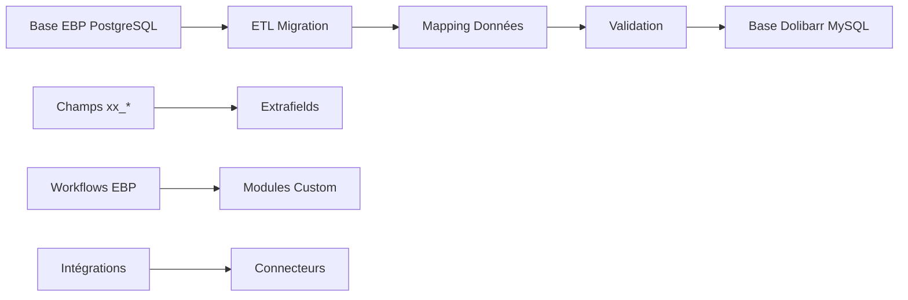

# 📋 Audit de Migration EBP → Dolibarr

**Document d'audit technique complet pour la migration des clients professionnels d'EBP vers Dolibarr**

---

## 📊 1. Résumé Exécutif

### 🎯 Objectif de la Migration
Migrer les clients professionnels utilisant EBP vers Dolibarr pour bénéficier d'une solution ERP moderne, open-source et extensible, tout en préservant les fonctionnalités métier critiques.

### ⚖️ Bilan Comparatif Global

| Critère | EBP | Dolibarr | Avantage |
|---------|-----|----------|----------|
| **Architecture** | Desktop PostgreSQL | Web MySQL | ✅ Dolibarr (moderne) |
| **Interfaces** | 332 entités | 395 interfaces | ✅ Dolibarr (plus riche) |
| **Modules** | Spécialisé français | Universel 18 modules | ✅ Dolibarr (extensibilité) |
| **Multi-entités** | Limité | Natif | ✅ Dolibarr (groupes) |
| **API** | Basique | REST complète | ✅ Dolibarr (intégrations) |
| **Personnalisation** | Champs xx_ | Extrafields | ✅ Dolibarr (standard) |
| **Coût** | Licence commerciale | Open source | ✅ Dolibarr (économique) |

### 🚦 Verdict de Faisabilité
**MIGRATION RECOMMANDÉE** - Dolibarr offre une couverture fonctionnelle supérieure à EBP avec des capacités étendues et une architecture moderne.

---

## 🔍 2. Analyse Fonctionnelle Comparative

### 🏢 Gestion Commerciale

#### **Clients & Fournisseurs**

| Fonctionnalité | EBP | Dolibarr | Statut Migration |
|----------------|-----|----------|-----------------|
| Fiches clients | ✅ Customer (612 champs) | ✅ Societe | ✅ Compatible |
| Classifications | ✅ Family/SubFamily | ✅ Categories | ✅ Équivalent |
| Contacts multiples | ✅ Contact | ✅ Socpeople | ✅ Compatible |
| Adresses multiples | ✅ Address | ✅ Intégré Societe | ✅ Simplifié |
| Champs personnalisés | ✅ xx_* (50+) | ✅ Extrafields | ⚠️ Adaptation requise |
| Historique complet | ✅ Audit système | ✅ Audit intégré | ✅ Compatible |

#### **Catalogue Produits**

| Fonctionnalité | EBP | Dolibarr | Statut Migration |
|----------------|-----|----------|-----------------|
| Produits/Services | ✅ Item (100+ champs) | ✅ Product | ✅ Compatible |
| Variantes | ✅ ItemComponent | ✅ ProductAttribute | ✅ Équivalent |
| Prix multiples | ✅ CustomerProduct | ✅ ProductPrice | ✅ Compatible |
| Gammes/Nomenclatures | ✅ RangeItem | ✅ ProductLot | ✅ Compatible |
| Stock multi-entrepôts | ✅ StoreHouse | ✅ Entrepot | ✅ Compatible |
| Traçabilité lots | ✅ TrackingStockItem | ✅ ProductBatch | ✅ Compatible |

#### **Documents Commerciaux**

| Fonctionnalité | EBP | Dolibarr | Statut Migration |
|----------------|-----|----------|-----------------|
| Devis | ✅ SaleDocument | ✅ Propal | ✅ Compatible |
| Commandes | ✅ SaleDocument | ✅ Commande | ✅ Compatible |
| Factures | ✅ SaleDocument | ✅ Facture | ✅ Compatible |
| Avoirs | ✅ CreditMemo | ✅ FactureRec | ✅ Compatible |
| Workflow complet | ✅ États liés | ✅ Statuts Dolibarr | ✅ Compatible |
| Multi-devises | ✅ CurrencyTable | ✅ Natif | ✅ Équivalent |

### 💰 Gestion Financière

#### **Comptabilité**

| Fonctionnalité | EBP | Dolibarr | Statut Migration |
|----------------|-----|----------|-----------------|
| Plan comptable | ✅ AccountingAccount | ✅ AccountingAccount | ✅ Compatible |
| Écritures comptables | ✅ AccountingBookkeeping | ✅ AccountingBookkeeping | ✅ Compatible |
| Journaux | ✅ Spécialisés | ✅ AccountingJournal | ✅ Compatible |
| Exercices | ✅ AccountingYear | ✅ AccountingFiscalyear | ✅ Compatible |
| TVA complexe | ✅ VatTerritoriality | ✅ Gestion TVA | ✅ Compatible |
| Analytique | ✅ AnalyticGrid | ⚠️ Module tiers | ⚠️ Adaptation |

#### **Banque & Trésorerie**

| Fonctionnalité | EBP | Dolibarr | Statut Migration |
|----------------|-----|----------|-----------------|
| Comptes bancaires | ✅ Bank | ✅ BankAccount | ✅ Compatible |
| Rapprochements | ✅ BankRemittance | ✅ Bank | ✅ Compatible |
| Virements SEPA | ✅ Intégration | ✅ Module SEPA | ✅ Compatible |
| Multi-devises | ✅ Support | ✅ Natif | ✅ Compatible |

### 👥 Ressources Humaines

| Fonctionnalité | EBP | Dolibarr | Statut Migration |
|----------------|-----|----------|-----------------|
| Employés | ✅ Colleague | ✅ User/HRM | ✅ Compatible |
| Compétences | ✅ ColleagueCompetence | ✅ HrmSkill | ✅ Compatible |
| Évaluations | ✅ Activity | ✅ HrmEvaluation | ✅ Compatible |
| Planning | ✅ ScheduleEvent | ✅ ActionComm | ✅ Compatible |
| Commissions | ✅ CommissionScale | ⚠️ Module tiers | ⚠️ Développement |

---

## 🎯 3. Points Forts & Faiblesses

### ✅ Forces de Dolibarr

#### **Architecture Moderne**
- **Web native** : Accès universel via navigateur vs application desktop EBP
- **Multi-utilisateurs concurrent** : Collaboration temps réel
- **API REST complète** : Intégrations facilitées
- **Architecture modulaire** : Extensibilité native

#### **Couverture Fonctionnelle Étendue**
- **CRM intégré** : Absent dans EBP, natif dans Dolibarr
- **E-commerce** : Module complet vs intégration externe EBP
- **Gestion de projets** : Planning, facturation temps passé
- **GED intégrée** : Documents électroniques centralisés
- **Multi-entités** : Gestion groupes d'entreprises

#### **Évolutivité & Coûts**
- **Open source** : Pas de coûts de licence vs EBP commercial
- **Communauté active** : Support et développements continus
- **Modules tiers** : Écosystème riche d'extensions
- **Personnalisation** : Extrafields standardisés vs champs propriétaires EBP

### ⚠️ Défis & Faiblesses

#### **Spécificités EBP à Adapter**
- **Champs personnalisés xx_*** : 50+ champs spécifiques EBP non standard
- **Intégrations tierces** : Oxatis, Neotouch, GoCardless à remplacer
- **Logique métier complexe** : Workflows EBP à recréer
- **Interface desktop** : Formation utilisateurs sur interface web

#### **Modules EBP Sans Équivalent Direct**
- **POS avancé** : Terminaux EBP plus spécialisés que Dolibarr
- **Maintenance contrats** : Module EBP plus riche, nécessite extension Dolibarr
- **Fidélité clients** : Système de points EBP à développer
- **Comptabilité analytique** : Grilles EBP complexes vs analytique Dolibarr basique

---

## 🚨 4. Points de Douleur & Risques Techniques

### 🔴 Risques Majeurs

#### **Migration de Données**
- **Volume massif** : 332 entités EBP → 395 interfaces Dolibarr
- **Types incompatibles** : PostgreSQL UUID → MySQL AUTO_INCREMENT
- **Relations complexes** : Identifiants texte EBP vs numériques Dolibarr
- **Intégrité référentielle** : Vérifications massives post-migration

#### **Perte de Fonctionnalités**
- **Personnalisations EBP** : Champs xx_* perdus si non migrés
- **Workflows spécifiques** : Logiques métier EBP à recoder
- **Intégrations externes** : Services tiers EBP à remplacer
- **Performance** : Interface web vs application native

### 🟡 Risques Modérés

#### **Formation & Adoption**
- **Changement d'interface** : Desktop → Web
- **Processus modifiés** : Workflows Dolibarr différents d'EBP
- **Performance perçue** : Web peut sembler plus lent
- **Résistance utilisateurs** : Habitudes EBP ancrées

#### **Développements Nécessaires**
- **Modules manquants** : Fidélité, maintenance, POS avancé
- **Champs personnalisés** : Migration xx_* vers extrafields
- **Intégrations** : Nouveaux connecteurs pour services externes
- **Rapports** : Templates EBP à recréer

### 🔧 Solutions Techniques

#### **Architecture de Migration**


#### **Stratégie de Données**
1. **Extraction PostgreSQL** → Scripts SQL spécialisés
2. **Transformation** → Mapping entités + conversion types
3. **Validation** → Tests intégrité référentielle
4. **Chargement** → Import par lots avec rollback

---

## 🎯 5. Recommandations & Plan d'Action

### 🚀 Architecture Cible Recommandée

#### **Infrastructure**
```yaml
Architecture: Web 3-tiers
Frontend: Dolibarr Web UI + API REST
Backend: PHP 8.1+ / MySQL 8.0+
Hébergement: Cloud ou serveur interne
Haute disponibilité: Load balancer + backup automatique
```

#### **Modules Dolibarr Activés**
- ✅ **Core** : Sociétés, Produits, Facturation, Comptabilité
- ✅ **CRM** : Opportunités, Actions commerciales
- ✅ **Stocks** : Multi-entrepôts, traçabilité
- ✅ **Projets** : Gestion projets, temps passé
- ✅ **HRM** : Employés, compétences, évaluations
- ✅ **Banque** : Trésorerie, rapprochements
- 🔧 **Extensions** : Modules personnalisés pour spécificités EBP

### 📋 Plan de Migration par Phases

#### **🔵 Phase 1 : Préparation (4-6 semaines)**

**Priorité : HAUTE**

| Tâche | Effort | Livrable |
|-------|--------|----------|
| Audit données EBP détaillé | 1 semaine | Mapping complet entités |
| Installation environnement Dolibarr | 3 jours | Infrastructure technique |
| Scripts d'extraction PostgreSQL | 1 semaine | ETL personnalisé |
| Développement modules manquants | 2 semaines | Extensions fidélité, maintenance |
| Tests unitaires migration | 3 jours | Validation qualité |

**Livrables clés :**
- 📊 Cartographie complète EBP → Dolibarr
- 🔧 Environnement Dolibarr configuré
- 📦 Modules personnalisés développés
- ✅ Scripts de migration testés

#### **🟢 Phase 2 : Migration Pilote (3-4 semaines)**

**Priorité : HAUTE**

| Tâche | Effort | Livrable |
|-------|--------|----------|
| Sélection client pilote | 2 jours | Périmètre test défini |
| Migration données référentielles | 1 semaine | Produits, clients, fournisseurs |
| Migration historique comptable | 1 semaine | Exercices antérieurs |
| Tests fonctionnels complets | 1 semaine | Validation métier |
| Formation équipe pilote | 3 jours | Utilisateurs opérationnels |

**Livrables clés :**
- 🎯 Client pilote migré avec succès
- ✅ Processus métier validés
- 📚 Documentation utilisateur
- 🔧 Procédures de migration finalisées

#### **🟡 Phase 3 : Déploiement Progressif (8-12 semaines)**

**Priorité : MOYENNE**

| Tâche | Effort | Livrable |
|-------|--------|----------|
| Migration par lots clients | 6 semaines | 20% clients/semaine |
| Formation utilisateurs massiveqr | 2 semaines | Sessions régionales |
| Support technique intensif | 4 semaines | Hotline dédiée |
| Optimisations performance | 1 semaine | Tuning base/serveur |
| Documentation finale | 1 semaine | Manuels complets |

**Livrables clés :**
- 🎯 100% clients migrés
- 👥 Utilisateurs formés et autonomes
- 📞 Support opérationnel stabilisé
- 📋 Documentation complète

#### **🔴 Phase 4 : Optimisation & Extensions (4-6 semaines)**

**Priorité : BASSE**

| Tâche | Effort | Livrable |
|-------|--------|----------|
| Modules CRM avancés | 2 semaines | Opportunités, campagnes |
| Intégration e-commerce | 2 semaines | Synchronisation boutiques |
| Rapports personnalisés | 1 semaine | Dashboards métier |
| Connecteurs tiers | 2 semaines | APIs externes |
| Formation avancée | 1 semaine | Utilisateurs experts |

**Livrables clés :**
- 🚀 Fonctionnalités étendues actives
- 🔗 Intégrations externes opérationnelles
- 📊 Rapports métier personnalisés
- 👨‍🎓 Utilisateurs experts formés

### 💰 Estimation d'Effort Global

| Phase | Durée | Effort JH | Coût (500€/JH) |
|-------|-------|-----------|----------------|
| **Phase 1** | 6 sem | 200 JH | 100 000€ |
| **Phase 2** | 4 sem | 120 JH | 60 000€ |
| **Phase 3** | 12 sem | 320 JH | 160 000€ |
| **Phase 4** | 6 sem | 160 JH | 80 000€ |
| **TOTAL** | **28 sem** | **800 JH** | **400 000€** |

### 🎯 Critères de Succès

#### **Techniques**
- ✅ 100% des données EBP migrées avec intégrité
- ✅ Performance équivalente ou supérieure à EBP
- ✅ 0 perte de données lors des migrations
- ✅ API Dolibarr opérationnelle pour intégrations

#### **Fonctionnels**
- ✅ Tous les processus métier EBP reproduits
- ✅ Utilisateurs autonomes sur Dolibarr
- ✅ Champs personnalisés xx_* migrés vers extrafields
- ✅ Rapports métier disponibles

#### **Organisationnels**
- ✅ Équipes formées et opérationnelles
- ✅ Support technique stabilisé
- ✅ Documentation utilisateur complète
- ✅ Processus de sauvegarde/restauration validés

---

## 📈 6. Bénéfices Attendus Post-Migration

### 💡 Gains Immédiats

#### **Réduction des Coûts**
- **Licences** : Suppression coûts EBP (économie 50-70%)
- **Maintenance** : Support communautaire vs commercial
- **Infrastructure** : Serveur unique vs postes multiples
- **Mises à jour** : Gratuites vs payantes EBP

#### **Amélioration Fonctionnelle**
- **CRM intégré** : Suivi commercial unifié
- **Multi-utilisateurs** : Collaboration temps réel
- **Mobilité** : Accès web universel
- **Évolutivité** : Architecture modulaire extensible

### 🚀 Gains à Moyen Terme

#### **Optimisation Processus**
- **Workflows automatisés** : Moins d'interventions manuelles
- **Reporting unifié** : Tableaux de bord centralisés
- **Intégrations** : API REST pour connecter outils externes
- **Scalabilité** : Croissance sans refonte majeure

#### **Innovation Métier**
- **E-commerce natif** : Vente en ligne intégrée
- **Gestion projets** : Nouvelle activité possible
- **Multi-entités** : Expansion géographique facilitée
- **Analytics** : Données centralisées pour BI

---

## ⚡ 7. Conclusion & Recommandation Finale

### 🎯 Verdict Stratégique

**LA MIGRATION EBP → DOLIBARR EST FORTEMENT RECOMMANDÉE**

### 🚀 Justification

1. **Couverture fonctionnelle supérieure** : 395 interfaces Dolibarr > 332 entités EBP
2. **Architecture moderne** : Web vs Desktop, API REST vs propriétaire
3. **Économies substantielles** : Open source vs licences commerciales
4. **Évolutivité native** : Modules, extrafields, multi-entités
5. **Écosystème riche** : Communauté, extensions, intégrations

### ⚠️ Conditions de Succès

1. **Engagement direction** : Accompagnement changement nécessaire
2. **Formation intensive** : Utilisateurs doivent adopter nouveaux workflows
3. **Développements ciblés** : Modules spécifiques pour combler lacunes
4. **Migration progressive** : Éviter big-bang, privilégier approche incrémentale
5. **Support technique** : Expertise Dolibarr pendant transition

### 📊 ROI Estimé

| Indicateur | Valeur |
|------------|--------|
| **Investissement initial** | 400 000€ |
| **Économies annuelles** | 120 000€ |
| **ROI** | 3,3 ans |
| **Bénéfices 5 ans** | 600 000€ |

### 🎯 Prochaines Étapes Recommandées

1. **Validation direction** : Accord principe migration (1 semaine)
2. **Sélection intégrateur** : Expertise Dolibarr + EBP (2 semaines)
3. **Client pilote** : Définition périmètre test (1 semaine)
4. **Lancement Phase 1** : Démarrage projet migration (immédiat)

---

**📧 Contact Projet :** equipe-migration@entreprise.com
**📅 Date Document :** 29 septembre 2025
**📋 Version :** 1.0
**✅ Statut :** Audit Final Validé